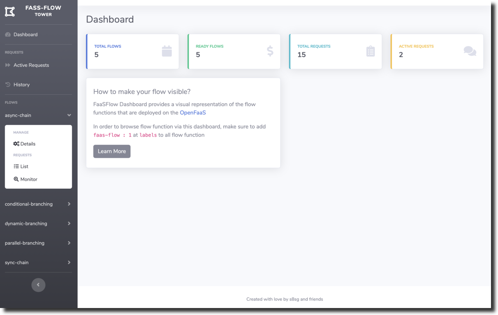

# faas-flow-tower
A monitoring function stack to visualize faas-flow functions and requests in realtime
    
### Dashboard
Dashboard provide details for each faas-flow functions incuding graphical representation of dags based on function definition

To make flow functions visible in dashboard add the below labels in `stack.yml` of each flow functions  
```
annotations:
   faas-flow-desc: "option labels to provide flow descriptions"
labels:
   faas-flow : 1
``` 
  
   
### Monitoring
Tower provides realtime timeline for requests for individual nodes of each faas-flow functions

Faasflow fetches the monitoring information from trace server    
For flow function enable tracing `enable_tracing: true` and set trace server url `trace_server: "jaegertracing:5775"`    
Provide the same trace server api url `trace_url: "jaegertracing:16686"` in `conf.yml`   
   

### Getting Started
FaaS-Flow Tower comes with the default `StateStore`, `DataStore` and `EventManager`

 |Item|Implementation|
 |---|---|
 |StateStore|[Consul StateStore](https://github.com/s8sg/faas-flow-consul-statestore)|
 |DataStore|[Minio DataStore](https://github.com/s8sg/faas-flow-minio-datastore)|
 |EventStore|[Jaguar](https://github.com/jaegertracing/jaeger)|


#### Deploy in Swarm 

##### Pre-reqs:
To deploy in swarm docker swarm need to installed and the targeted node need to have swarm cluster initialized. To initialize a swarm cluster follow this guide: https://docs.docker.com/engine/swarm/swarm-mode/.  
   
FaasFlow Tower also requires the OpenFaaS to be deployed. You can either have your OpenFaaS deployed in Kubernets otherwise in Swarm. To deploy OpenFaaS follow this guide: https://docs.openfaas.com/deployment/

> Note: If you have deployed your OpenFaaS in Kubenets, it is recomanded to deploy FaaSFlow Tower services in same environment

##### Clone the Repo
```
git clone https://github.com/s8sg/faas-flow-tower
cd faas-flow-tower
```

##### Set OpenFaaS Gateway
Update the `stack.yml` with the gateway url
```yaml
provider:
  name: faas
  gateway: http://127.0.0.1:8080
```

##### Set Configuration
Configuration are defined in `conf.yml`. Based on your deployment you may need to update the configuration before you use the deployment script.   
```yaml
environment:
  gateway_url: "http://gateway:8080/"
  # gateway_url: "http://openfaas.gateway:8080/" (if OpenFaaS deployed in kubernets)
  gateway_public_uri: "http://localhost:8080"
  basic_auth: true
  secret_mount_path: "/var/openfaas/secrets"
  trace_url: "http://jaegertracing:16686/"
  # gateway_url: "http://openfaas.jaegertracing:8080/" (if OpenFaaS deployed in kubernets)
```

###### Gateway URL   
Change the `gateway_url` into `http://openfaas.gateway:8080/` if OpenFaaS deployed in the kubernets, otherwise set it to `http://gateway:8080/` for swarm.    

###### Trace URL
Set the `trace_url` to the swarm node ip if OpenFaaS deployed in the kubernets. To get a swarm node IP use
```
docker node inspect self --format '{{ .Status.Addr  }}'
```
Set the trace url ('trace_url') to `http://jaegertracing:16686/` if OpenFaaS is deployed in Swarm.   


##### Deploy with the script
```
./deploy.sh
```
This script will deploy the function in the OpenFaaS and the other services in Swarm


#### Deploy in Kubernets
For deploying in kubernets Faas-Flow Tower provide helm charts 

##### Pre-reqs:
###### Install the helm CLI/client

Instructions for latest Helm install

* On Linux and Mac/Darwin:

      curl https://raw.githubusercontent.com/kubernetes/helm/master/scripts/get | bash

* Or via Homebrew on Mac:

      brew install kubernetes-helm

###### Install tiller

* Create RBAC permissions for tiller

```sh
kubectl -n kube-system create sa tiller \
  && kubectl create clusterrolebinding tiller \
  --clusterrole cluster-admin \
  --serviceaccount=kube-system:tiller
```

* Install the server-side Tiller component on your cluster

```sh
helm init --skip-refresh --upgrade --service-account tiller
```

> Note: this step installs a server component in your cluster. It can take anywhere between a few seconds to a few minutes to be installed properly. You should see tiller appear on: `kubectl get pods -n kube-system`.
